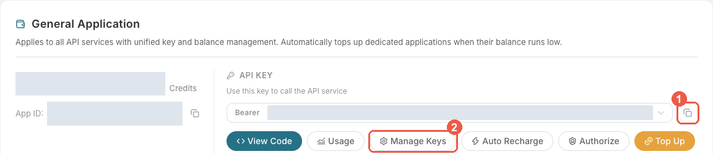
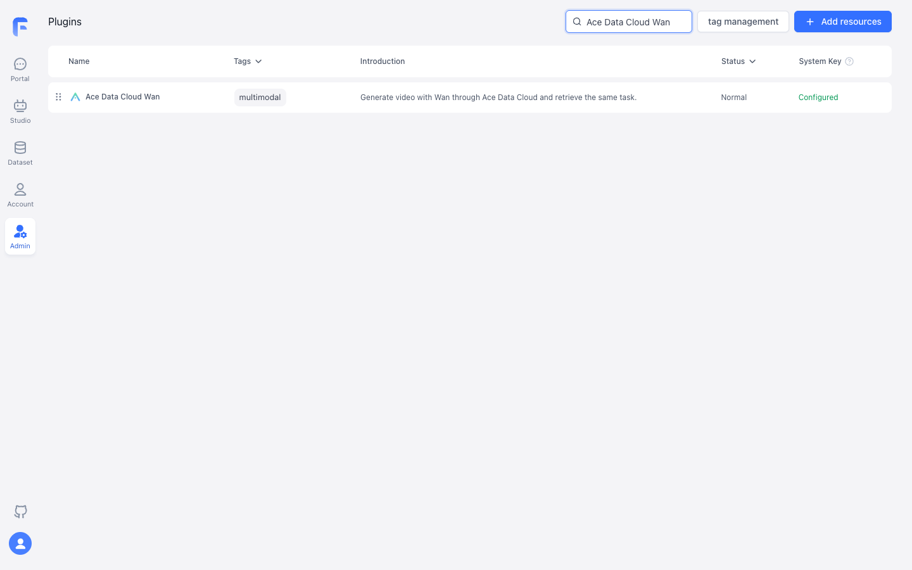
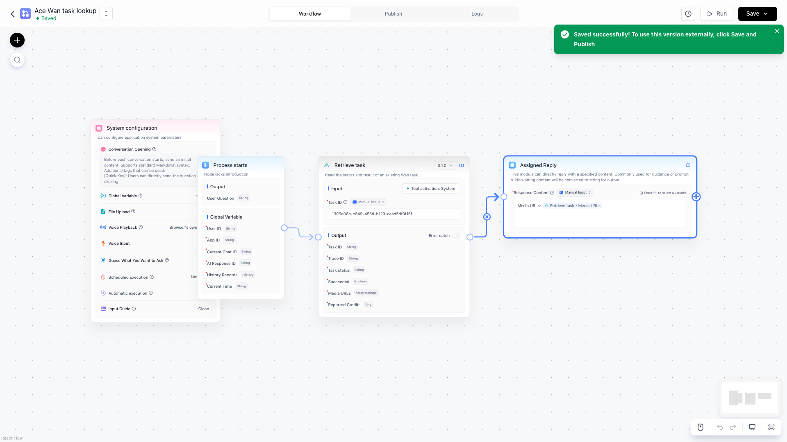
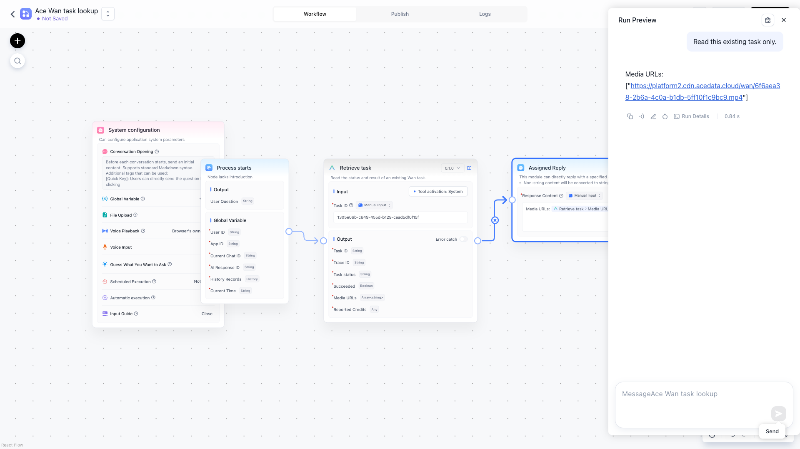

# Ace Data Cloud Wan for FastGPT

Generate video and retrieve the result in a FastGPT workflow. [简体中文](README_zh_CN.md) · [Current pricing](https://platform.acedata.cloud/models)

## Quick start

### 1. Install

Use FastGPT 4.15 or later. Once published, search FastGPT Marketplace for **Ace Data Cloud Wan** and verify the author is **Ace Data Cloud**. Before listing, a business or self-hosted administrator can build and upload this repository's .pkg. FastGPT Cloud does not currently allow direct custom plugin uploads.

### 2. Get an API key

Sign in to [Ace Data Cloud → Applications](https://platform.acedata.cloud/console/applications), open **General Application**, and confirm **Wan** access, balance, and current price. Copy the key using icon **1** below; or select **2 Manage Keys → Create** for a separate FastGPT key. If **Allowed APIs** is enabled, include both /wan/videos and /wan/tasks. In the FastGPT plugin configuration, paste only the key into **Ace Data Cloud API key**, without Bearer or quotes.

### 3. Build the first workflow

In **Studio → Create Agent → Workflow**, start with **Process starts**. From **System Tools**, add **Ace Data Cloud Wan / Generate video** and **Retrieve task**. Activate both tools with the configured **System secret**. Connect **Process starts → Generate video → Retrieve task → Basic / Assigned Reply**. Enter:

| Generate field | First-run value |
|---|---|
| Model | wan3.0-video |
| Duration | 5 |
| Resolution | 720P |
| Ratio | 16:9 |
| Audio | false |

**Prompt**: A teal cube slowly rotates on a cream tabletop, studio lighting, no text.

For **Retrieve task → Task ID**, choose **Variable Reference → Generate video → Task ID**. In **Assigned Reply**, insert the Retrieve task outputs (status, success, taskId, mediaUrls, and costCredits) with the variable picker. Choose **Save Only**, then **Run Preview** once. If status is pending, save taskId. To check later, create a separate **Process starts → Retrieve task → Basic / Assigned Reply** workflow and enter that same ID. Running the generation workflow again submits and bills another generation.

When status is succeeded and success is true, open a link from mediaUrls. Match the task ID and reported Credits with Ace Data Cloud request history; pricing and your package exchange rate may change.

The FastGPT screenshots below show installation and a **read-only query of a previously generated task**. They do not show a new FastGPT generation.

### 4. Copyable no-key example

[examples/generate.json](examples/generate.json) contains no credentials. Create a local .secrets.local.json containing {"apiKey":"YOUR_OWN_KEY"}, then:

~~~sh
pnpm install
pnpm exec fastgpt-plugin debug . --run --tool generate --input-file examples/generate.json --secrets-file .secrets.local.json
pnpm exec fastgpt-plugin build --entry . --output ./dist
pnpm exec fastgpt-plugin check --entry . --output ./dist
pnpm exec fastgpt-plugin pack --entry . --dist ./dist --output ./out
~~~

For a pending result, create a local examples/retrieve.local.json with {"taskId":"THE_RETURNED_TASK_ID"}. Use the same secret file and run only:

~~~sh
pnpm exec fastgpt-plugin debug . --run --tool retrieveTask --input-file examples/retrieve.local.json --secrets-file .secrets.local.json
~~~

Local secret files are ignored by Git. Do not publish them.

| What you see | What to do |
|---|---|
| 401 / 403 | Check key, expiration, Wan access, Allowed APIs, and balance. |
| 400 | Start with the exact first-run fields and inspect the rejected parameter. |
| pending / no media | Query only the same task ID later. |
| 429 | Wait and lower concurrency; never enable automatic paid generation retries. |
| timeout / 5xx / failed | Inspect the original task and request history before resubmitting. Give support the task or trace ID, never your key. |

The plugin sends the selected inputs and token to api.acedata.cloud. Calls follow [current pricing](https://platform.acedata.cloud/models). [Privacy](PRIVACY.md) · [Source and support](https://github.com/AceDataCloud/WanFastGPT/issues).
